#通过重载`new`,`delete`实现对在动态内存分配中内存越界和内存泄露的自动检测
 

##目录

[1.什么是内存泄漏](#1)  
……[1.1  简介](#1.1)   
……[1.2  危害](#1.2)  
……[1.3  分类](#1.3)  
……[1.4  解决内存泄漏](#1.4)  
[2.`new`和`delete`的重载初步介绍](#2)    
……[2.1 系统提供的`new`和`delete`](#2.1)  
……[2.2 `operator new`和`operator delete`函数及其参数说明](#2.2)  
……[2.3 `new`和`delete`表达式操作过程](#2.3)  
……[2.4 `new`和`delete`重载本质](#2.4)  
[3.通过重载`new`和`delete`自动检测内存泄漏](#3)   
……[方法一：](#first)   
…………[3.1.1 算法](#3.1)    
…………[3.1.2 代码](#3.2)  
…………[3.1.3 功能](#3.3)   
…………[3.1.4 测试](#3.4)  
…………[3.1.5 进一步探讨](#3.5)   
……[方法二 ：](#second)   
…………[3.2.1 算法](#s.1)    
…………[3.2.2 代码](#s.2)  
…………[3.2.3 功能](#s.3)  
…………[3.2.4 测试](#s.4)   
[4.什么是内存越界](#4)    
……[4.1 简介](#4.1)  
……[4.2 危害](#4.2)  
……[4.3 解决内存越界](#4.3)  
[5.通过重载`new`自动检测内存越界](#5)  
……[5.1 算法](#5.1)   
……[5.2 代码](#5.2)  
……[5.3 功能](#5.3)  
……[5.4 测试](#5.4)  
……[5.5 进一步探讨](#5.5)  
[6.结语](#6)  
[7.参考资料](#7)  
[8.作者信息](#8)  

 
 
 
 
###1.什么是内存泄漏  
####*简介  
**`内存泄漏`**是当程序不正确地进行内存管理时出现的一种资源泄漏，表现为程序不再需要使用的内存空间并没有及时被释放掉。内存泄漏并非指物理内存的消失，而是在程序分配了某段内存后，由于设计错误，失去了对该段内存的控制，造成了内存的浪费.  

####*危害
内存泄漏减少计算机可用内存，从而影响了计算机的性能。如果内存泄漏过于严重，整个操作系统、应用程序甚至会崩溃，计算机性能会大打折扣。但是，一般情况下，在现代操作系统中，当一个应用程序结束的时候，该应用程序所占用的内存会被操作系统自动地全部释放，因此，内存泄漏的后果往往不会很严重，甚至不会被察觉到。但是，当长时间运行程序或者设备内存较小时，内存泄漏的问题就不容忽视。作为程序员，我们有必要尽力避免内存泄漏，养成良好的编程习惯.  

####*分类
内存泄漏尤其会发生在没有垃圾回收机制（Garbage collection）的编程语言，例如：C和C++，也就是说程序并不会自动实现内存管理。对于C和C++这两种语言，我们主要关心两种类型的内存泄漏:  
	1.堆内存泄漏：程序通过`malloc`,`realloc`,`new`等函数在堆空间中申请了一块内存，但是在使用完后并没有用`free`，`delete`等函数将所申请的内存的内存释放掉，导致相应的那块内存一直被占用。
	2.系统资源泄漏：程序在使用系统分配的资源比如Bitmap,handle等之后，并没有用相应的函数释放掉，导致相应内存的占用和系统资源的浪费。  
	本次只针对**堆内存泄漏**提出自动检测的方法。
	
####*解决内存泄漏
解决内存泄漏的困难之处在于：1.编译器不能发现这些问题；2.在程序运行时才有可能捕捉到这些错误，而且这些错误没有明显的症状，时隐时现；3.一般解决内存泄漏必须需要程序员获得源码，通过修改源码的方式解决，比较耗时。  
	因此，我们需要想出一种简便的方法，可以较大程度地自动检测出内存泄漏，及时提醒程序员对程序进行修正，在此我们通过重载`new`、`delete`函数的方式实现了自动检测的功能，下面将介绍`new`和`delete`函数。

###2.`new`和`delete`及其重载初步介绍

####*系统提供的`new`和`delete`
标准库定义了`operator new`函数和`operator delete`函数的8个重载版本。其中前4个版本可能会抛出`bad_alloc`异常，后4个版本则不会抛出异常。
  
~~~cpp
//这些版本可能会抛出异常
void *operator new (size_t);			   //分配一个对象
void *operator new[] (size_t);			   //分配一个数组
void operator delete (void* ) noexcept;    //释放一个对象
void operator delete[] (void* ) noexcept;  //释放一个数组
~~~  
~~~cpp
//这些版本承诺不会抛出异常
void *operator new (size_t, nothrow_t&) noexcept;
void *operator new[] (size_t,nothrow_t&) noexcept;
void operator delete (void*, nothrow_t& ) noexcept;
void operator delete[] (void*, nothrow_t& ) noexcept;
~~~

####*`operator new`和`operator delete`函数及其参数的说明  
重载`new`函数必须有一个`size_t`参数,这个参数**由编译器产生并传递给我们**，它是要分配内存的对象的**长度**。类型`nothrow_t`是定义在`new.h`中的一个`struct`，在这个类型中不包含任何成员。加上这个参数后会**阻止**参数抛出异常。  

对于`operator new`函数或者`operator new[]`函数来说，它的函数返回类型必须是`void*` ，第一个形参必须是`size_t`且该形参不能含有默认实参。如果我们想自定义`operator new`函数，则可以为它提供额外的形参。对于`operator delete`函数或者`operator delete[]`函数来说，它们的返回类型必须是`void`,第一个形参类型必须是`void*` ，也可以提供额外的形参。  

但是以下函数却无论如何**不能**被用户重载：

~~~cpp 
void *operator new (size_t, void *)，
~~~ 
 这种形式只能供标准库使用，不能被用户重新定义。
 
####*`new`和`delete`表达式操作过程
当我们使用一条`new`表达式的时候，实际上执行了**三步**操作:  
**第一步**，`new`表达式调用一个名为`operator new`（或者`operator new[]`）的标准库函数。该函数分配一块足够大的、原始的、未命名的内存空间以便存储特定类型的对象（或者对象的数组）。  
**第二步**，编译器运行相应的构造函数以构造这些对象，并为其传入初始值。  
**第三步**，对象被分配空间并构造完成，返回一个指向该对象的指针。  

当我们使用一条`delete`表达式删除一个动态分配的对象时，实际执行了**两步**操作：  
**第一步**，对指针所指对象或者所指数组中的元素执行对应的**析构函数**。  
**第二步**，编译器调用名为`operator delete`(或者`operator delete[]`)的标准哭函数释放内存空间。  
  
####*`new`和`delete`重载的本质
一条`new`表达式的执行过程总是先调用`operator new`函数以获取内存空间，然后在得到的内存空间中构造对象。与之相反，一条`delete`表达式的执行过程总是先析构对象，然后调用`operator delete`函数释放对象所占内存。因此，用户提供的的`operator new`函数和`operator delete`函数的目的在于改变内存的分配方式，但是不管怎么样，我们都不能改变`new`运算符和`delete`运算符的基本含义。（不能让new去做加法）  

###3.通过重载`new`／`delete`实现对动态内存分配中内存泄漏的检测
####方法一：
####*算法  
1.创建一个位于静态数据区域的类`Trace`的对象`m_trace`,这样当`main`函数退出的时候，`m_trace`的**析构函数**一定会执行，那么可以通过这个一定执行的函数来判断动态申请的内存是否被释放。  
	2.在`Trace`类中建立一个`map`，该`map`是**内存空间到存储内存信息类的映射**，在每次执行`new`时都会在`map`中添加这样一个映射，而在每次执行`delete`时会删除`map`中相应内存的信息。这样，如果`new`分配的每一段内存都经过`delete`释放，那么`map`在`main`结束时应该为空，反之，如果在程序结束时，`map`不为空则说明有内存未被释放，即发生了内存泄漏。  
	将上述判断`map`是否为空的函数放到刚才所说的**析构函数**中，这样就能保证判断**一定会执行该函数**，程序也能够自动判断内存是否发生内存泄漏。  
	3.一些细节值得我们注意。在重载了`new`以后，`string`类的建立和删除是要调用`new`和`delete`的，因此为了减少麻烦，我们这里是不使用`string`类的，我们将使用`string`类的地方用`C`风格的字符串`char*`来替代。  
	本程序中使用了`map`这种数据结构，这样做使得我们建立的“内存清单”**更方便查找**（我们也可以自己建立一个`链表`来实现类似的功能，不过这样做比较麻烦），但是需要注意的是，`map`中的数据在删除时是会调用`delete`的，所以我们应该想出一种机制，避免重载后`delete`对`map`中的数据释放有任何的影响（后面还会详细地解释）。  

####*代码
>文件名:MemoryLeakCheck.h

~~~cpp  
 /*
 /*
* MemoryLeakCheck.h
*
* Trace类中成员函数的声明,重载new,delete的声明
*
* Author:雷怡然
*
* Date:2017/5/25
*/
#ifndef MEMORYLEAKCHECK_H_
#define MEMORYLEAKCHECK_H_

#include <map>
using namespace std;

class Trace
{
public:
	class Entry														
		//Entry类用来记录分配内存的信息
	{
	public:
		char *File;													
		//用来记录发生内存泄漏的源文件名称
		int Line;													
		//用来记录未调用delete释放内存的new所在行数
		Entry():Line(0){}											
		//默认构造函数
		Entry(char m_file[],int m_line):Line(m_line),File(m_file){}	
		//重载构造函数
		~Entry(){}													
		//析构函数
	};

	class Lock														
	/*Lock类用来避免delete对map在
	清楚数据时使用delete造成干扰*/
	{
	public:
		Lock(Trace &tracer):_trace(tracer){_trace.lock();}
		~Lock(){_trace.unlock();}
	private:
		Trace& _trace;												
		//成员变量是类Trace的引用
	};

private:
	int m_locktimes;												
	//用来判断是不是map调用的delete
	map<void*,Entry > m_map;										
	/*记录内存分配的map，键值为new分配的
	内存地址，对应的值为类Entry，储存new
	所在的文件和行数*/
	typedef map<void*,Entry>::iterator m_iterator;				   
	//重命名map<void*,Entry>迭代器的名字
public:
	int getMapSize();												
	//用来获取m_map的长度
	bool on;														
	/*用来表示Trace的对象是否存在,即
	main函数是否结束,true表示未结束,
	false表示析构函数执行，即主函数结束*/
	void lock();													
	//用来使m_locktimes++
	void unlock();													
	//用来使m_locktimes--
	void addMap (void *p,char* m_file,int m_line);					
	//用来添加map中的信息
	void deleteMap (void *p);										
	//用来删除map中的信息	
	void checkMap ();												
	/*用来检查m_map中的是否存有元素, 
	并进行汇报,如果发生内存泄漏，
	释放占用内存*/
	Trace():on(true),m_locktimes(0){}						
	/*程序开始后，会将on设为true,
	m_locktimes的值设为0。即若on==true，
	则主函数未结束*/
    ~Trace();
};

void* operator new (size_t size,char *m_file,int m_line);			
/*重载new运算符,char* m_file是文件名,int m_line是行数*/
void* operator new[] (size_t size,char *m_file,int m_line);
void* operator new (size_t size);
void operator delete (void *p);
void operator delete[] (void *p);
#endif
~~~

>文件名:MemoryLeakCheck.cpp

~~~cpp
/*
* MemoryLeakCheck.cpp
*
* Trace类中成员函数的定义,重载new,delete的定义
*
* Author:雷怡然
*
* Date:2017/5/25
*/

#include "MemoryLeakCheck.h"
#include <fstream>								
//将检测的结果输入到了文件log.txt中
#include <iostream>

Trace m_trace;									
//类m_trace的全局实例对象

Trace::~Trace()									
//类Trace的析构函数
{
	checkMap();					                
//在析构函数执行的时候调用checkMap()函数，检查是否发生内存泄漏
	if (on==true)				                
//当析构函数执行的时候，即主函数结束的时候，将on设为false
		on=false;
}

void Trace::lock ()								
/*类Lock的构造函数执行的函数lock函数。即Lock类建立时,
m_locktimes会加1*/
{
	m_locktimes++;
}

void Trace::unlock ()				          
/*类Lock的析构函数执行的函数unlock函数。即Lock类被析构时
,m_locktimes会减1*/
{
	m_locktimes--;
}

void Trace::addMap(void *p,char *m_file,int m_line)	
//向数据结构map中添加新的数据
{  
	    if(m_locktimes>0)						
//正常情况下，一开始由构造函数 初始化使得m_locktimes==0
			return;
		Trace::Lock locker(*this);			   
/*如果陷入了迭代循环,每次迭代会使m_locktimes++，那么上面的
如果(m-locktimes>0)为真，则表明陷入了迭代，为避免程序崩溃，
直接return*/
		m_map[p] = Entry (m_file,m_line);
}

void Trace::deleteMap(void *p)
{
	if (m_locktimes>0)							
/*我们在抹去m_map中的数据时，erase函数会调用delete来删除数据，
那么就可能产生一个死循环的迭代。*/
		return ;
	Trace:: Lock locker(*this);			        
/*当用户使用delete函数时，通过if判断(没有直接return)执行
deleteMap函数，此时m_locktimes==0,但是但此处使得m_locktimes==1，
即下一次迭代会退出*/
	cout<<"delete memory,"<<m_map[p].File<<",line "
		<<m_map[p].Line<<endl;
	m_iterator temp= m_map.find(p);
	m_map.erase(temp);						    
/*然后调用erase函数，erase函数会再次调用delete函数，但如果
再次进入deleteMap函数，由于m_locktimes==1会直接返回,然后到
上一层执行free函数，然后完成erase函数，然后再返回原来的
delete函数，完成内存空间的释放*/
}

void Trace::checkMap()
{
	void *temp=NULL;
	ofstream out("log.txt",ofstream::app);		
//建立文件输出流，将每次内存泄漏的检测结果记录到文件log.txt中
	out<<__DATE__<<"\t"<<__TIME__<<endl;		
//输出程序运行的具体时间
	if (m_map.size())						    
/*在程序结束时，如果m_map没有清空，那么说明有用户分配的
内存空间没有被释放，即发生了内存泄漏*/
	{
		cout<<"Memory Leak Detected!"<<endl;
		out<<"Memory Leak Detected!"<<endl;
		for(m_iterator it =m_map.begin();it!=m_map.end();
			it=m_map.begin())	
/*检测到程序发生了内存泄漏，则自动释放用户忘记释放的内存*/
		{
			cout<<"file:"<<it->second.File<<",line:"
				<<it->second.Line<<endl;
			out<<"file:"<<it->second.File<<",line:"
				<<it->second.Line<<endl;
			temp=it->first;															
			deleteMap(temp);					
			//删除m_map中数据
			free(temp);			                
			//删除用户分配的空间
		}
		cout<<"Leak memory released!"<<endl;
		out<<"Leak memory released!"<<endl;
	}
	else								        
		//如果m_map为空，那么说明没有发生内存泄漏
		{
			cout<<"Memory Leak Not Detected!"<<endl;
			out<<"Memory Leak Not Detected!"<<endl;
		}
	out<<endl;
}

int Trace::getMapSize()
{
	return m_map.size();					   
	/*为了数据安全，将m_map类型设为private，
	用public的getMapSize函数来获取m_map的长度*/
}

void* operator new (size_t size,char *m_file,int m_line)
{
	void* p = malloc (size);
	if (m_trace.on==true)				       
	/*on==true的时候，表示主函数正在运行；
	如果on变为false，则跳过if中的语句。
	（可能程序在main之后还会调用new，这时需
	要使new恢复原来的样子）*/
		m_trace.addMap(p,m_file,m_line);		
	//在m_map中插入数据
	return p;
}

void* operator new[] (size_t size,char *m_file,int m_line)		 
	//数组版的new
{
	void* p = malloc (size);
	if (m_trace.on==true)
		m_trace.addMap(p,m_file,m_line);
	return p;
}

void operator delete (void *p)																
{
	if (m_trace.on==true&&m_trace.getMapSize())		
		/*当m_map的长度为0时，不用调用我们自己
		的deleteMap函数。程序可能会在main函数结
		束后调用delete,这种情况m_map中没有存有
		相关的信息，因此不能执行deleteMap函数。
		同时，这样的条件判断又可以保证用户分配的内
		存都可以被执行到*/
		m_trace.deleteMap (p);
	free(p);
}
 
void operator delete[] (void *p)				  
	//delete数组
{
	if (m_trace.on==true&&m_trace.getMapSize())
		m_trace.deleteMap(p);
	free(p);
}

void* operator new (size_t size)
//一些容器会调用这个new（即使new重载也不会调用重载版本的new）
{
	void* p = malloc (size);
	if (m_trace.on==true)			
		m_trace.addMap(p,"?",0);		
	return p;
}
~~~

>文件名:define.h

~~~cpp
/*
* define.h
*
* new的宏定义
*
* Author:雷怡然
*
* Date:2017/5/25
*/

#define new new(__FILE__, __LINE__)	
/*宏定义,把new替换成我们定义的
operator new (size_t size,char *m_file,int m_line)函数
用到了__FILE__,__LINE__宏来获取当前文件名和当前行数*/
												
~~~

####*功能
实现了通过重载`new`和`delete`自动检测内存泄漏，当使用`delete`时，会输出调用了`delete`的信息，并输出`delete`对应的`new`所在的文件和行数。当发生内存泄漏时，输出**`Memory Leak Detected!`**,并且自动释放用户忘记释放的内存；如果没有发生内存泄漏，那么输出**`Memory Leak Not Detected!`**,并将是否发生内存泄漏的信息写到log.txt中。

####*测试
#####case1:
>文件名：main.cpp

~~~cpp
#include "MemoryLeakCheck.h"
#include "define.h"
#include <iostream>

int main ()
{
	int *a=new int[5];
	a[0]=3;
	return 0;
}
~~~
>没有及时释放内存，控制台输出结果：  
>  
>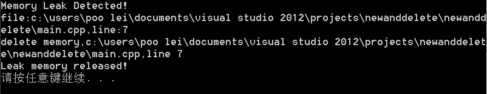
>文件写入的内容：  
>
>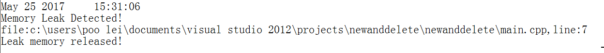

#####case2:
>文件名：main.cpp  

~~~cpp
#include "MemoryLeakCheck.h"
#include "define.h"
#include <iostream>

int main ()
{
	int *a=new int[5];
	delete a;
	return 0;
}
~~~

>正常操作，没有发生内存泄漏，控制台输出结果：
>
>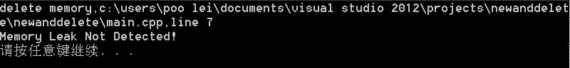
>文件写入内容：
>
>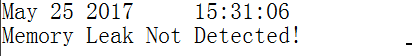

#####case3:
>文件名:main.cpp

~~~cpp
#include "MemoryLeakCheck.h"
#include "define.h"
#include <iostream>

class cat
{
private:
	int name;
	int weight;
	int length;
public:
	cat():name(0),weight(0),length(0){}
	~cat(){}
};

int main ()
{
	cat* a=new cat;
	return 0;
}
~~~

>`new`新建了一个类，发生了内存泄漏，控制台输出结果：
>
>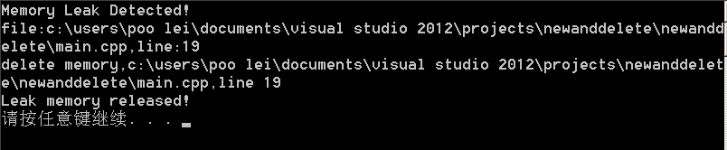
>文件写入内容:
>
>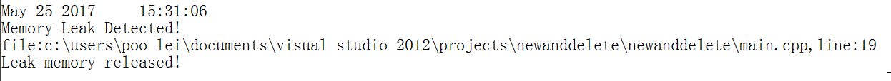

#####case4:
>文件名:main.cpp

~~~cpp
#include "MemoryLeakCheck.h"
#include "define.h"
#include <iostream>
#include <string>

int main ()
{
	string b;
	return 0;
}
~~~

>没有发生内存泄漏，但是调用了`new`和`delete`，控制台输出结果：
>
>
>文件写入内容:
>
>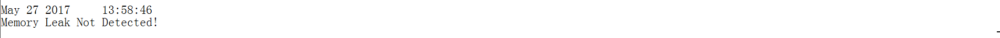

####*进一步探讨
通过重载`new`和`delete`的方法，实现了内存泄漏的自动检测。但是，在编写程序的过程中，我发现重载了`operator new` 函数

~~~cpp
void* operator new (size_t size,char* m_file,int m_line);
~~~
并且通过宏定义重新定义了`new`

~~~cpp
#define new new(__FILE__,__LINE__)
~~~
但是系统在创建容器类对象(`string`,`map`,`set`等)时，并不会调用我们宏定义的`operator new`函数，而是会去调用系统提供的`operator new`的默认版本,也就是

~~~cpp
void* operator new (size_t size);
~~~

但是`operator delete`函数却不是这样，并不能使用类似`new`的宏定义，而是只会调用：

~~~cpp
void delete (void* p);
~~~

本程序本程序直接重载了

~~~cpp
void operator delete (void* p);
~~~
也就是说用户使用的`delete`运算符以及容器类实例自动删除时都会调用该重载函数。但是，`operator new`重载了两个版本，分别是：

~~~cpp
void* operator new(size_t size);
void* operator new(size_t size,char* m_file,int m_line);
~~~
这样就保证了只要调用`new`，那么一定会在`m_map`中建立相应的映射，相应地`delete`就不会出错(否则，可能删除"不存在的信息"而导致程序崩溃)。而`void * operator new (size_t size)`版本中向`m_map`添加的文件名是`?`,行数是`0`（因为参数只有`size_t`,没有接口可以获取`string`,`set`等调用`new`所对应的文件名和行数）。  
这种方法记录的信息很详细全面（包括内存泄漏的文件名以及行数），但是这种方法似乎有些麻烦，我们可能需要一个更简洁（不需要如此详细的）版本，来检查是否发生了内存泄漏。

####方法二：
####*算法：
我们可以不使用数据结构`map`来存储`new`分配的内存的信息，我们可以把`operator new`函数返回的`void*p`指向的内存地址存储起来，同时把`delete`的指针所指向的内存地址也存储起来。最后在一个全局类的实例对象的析构函数中执行比较函数。  

为了更方便地比较，我们这里使用了数据结构`set`，其存储的数据为`string`,即指针所指向内存的地址。因为`set`对于`string`是按照`字典排序`的顺序排列的（这个排序过程是自动的），所以如果没有发生内存泄漏，那么两个`set`中的元素个数是一样的，同时，对应位的`string`也应该是相同的，如果不同时满足上述两个条件，那么说明发生了内存泄漏。  

这种方法没有存储new表达式所在的文件名和行数，因此，直接重载了：

~~~cpp
void* operator new (size_t size);
~~~
即可满足要求（根据前面的讨论可知，`string`,`set`等容器类对象建立的时候，会调用该函数）。

####*代码：
>文件名:MemoryLeakCheck.h

~~~cpp
/*
* MemoryLeakCheck.h
*
* Examine类中成员函数的声明,重载new,delete的声明
*
* Author:雷怡然
*
* Date:2017/5/30
*/
#ifndef MEMORYLEAKCHECK_H_ 
#define MEMORYLEAKCHECK_H_

#include <set>
#include <string>
using namespace std;

class Examine
{
private:
	set<string> fromNew;			//两个存储分配的内存地址的集合
	set<string> fromDelete;
	typedef set<string>::iterator m_iterator;
	int locktimes;					//防止死循环
public:
   Examine():on(true),locktimes(0){}
	~Examine();
	bool on;							//析构函数是否执行
   void compareSet ();
	void addSetFromNew (void *p);
	void addSetFromDelete(void *p);
	void reportLeak();
	void reportNotLeak();
	void lock();
	void unlock();
public:
	class Lock						//防止死循环
	{
		Examine& _exam;
	public:
		Lock(Examine&r):_exam(r){_exam.lock();}
		~Lock(){_exam.unlock();}
	};
};

void* operator new (size_t size);
void* operator new;
void operator delete (void* p);
void operator delete[] (void* p); 

#endif
~~~

>文件名:MemoryLeakCheck.cpp

~~~cpp
/*
* MemoryLeakCheck.cpp
*
* Trace类中成员函数的定义,重载new,delete的定义
*
* Author:雷怡然
*
* Date:2017/5/30
*/
#include "MemoryLeakCheck.h"
#include <iostream>
#include <fstream>
#include <string>
#include <sstream>
Examine m_exam;

Examine::~Examine()
{
	on = false;
	compareSet();
}

void Examine::compareSet()
{
	int lengthNew = fromNew.size(),
		lengthDelete = fromDelete.size();
	if (lengthNew != lengthDelete)
	{
		reportLeak();
		return;
	}
	m_iterator i,j;						//比较两个集合是否一样
	for (i = fromNew.begin(),j = fromDelete.begin();
		i != fromNew.end(); )
	{
		if (*i != *j)
		{
			reportLeak();
			return;
		}
		i++;
		j++;
	}
	reportNotLeak();
}

void Examine::lock()
{
	locktimes++;
}

void Examine::unlock()
{
	locktimes--;
}

void Examine::reportLeak ()			//发生内存泄漏的输出
{
	ofstream out("log.txt",ios::app);
	cout <<"Memory Leak Detected!"<<endl;
	out<<__DATE__<<"  "<<__TIME__<<endl<<"Memory Leak Detected!"<<endl<<endl;
}

void Examine::reportNotLeak()       //未发生内存泄漏的输出
{
	ofstream out("log.txt",ios::app);
	cout<<"Memory Leak Not Detected!"<<endl;
	out<<__DATE__<<"  "<<__TIME__<<endl<<"Memory Leak Not Detected!"<<endl<<endl;
}

void Examine::addSetFromNew(void* p)
{
	if (m_exam.locktimes>0)				//防止死循环
		return;
	Examine::Lock locker(*this);
	if (p == NULL)
		return;
	stringstream stream;				
	//用string流的方式获取指针指向内存的地址（的字符串）
	string name;
	stream<<p;
	stream>>name;
	fromNew.insert (name);
}

void Examine::addSetFromDelete (void *p)
{
	if (m_exam.locktimes>0)			
		return;
	Examine::Lock locker(*this);
	if (p == NULL)
		return;
	stringstream stream;
	string name;
	stream<<p;
	stream>>name;
	fromDelete.insert (name);
}

void* operator new (size_t size)
{
	void *p = malloc (size);
	if (m_exam.on == true)		//主函数未结束，析构函数未执行
		m_exam.addSetFromNew(p);
	return p;
}

void* operator new 
{
	void *p = malloc(size);
	if (m_exam.on == true)
		m_exam.addSetFromNew(p);
	return p;
}

void operator delete (void* p)
{
	if (m_exam.on == true)
			m_exam.addSetFromDelete(p);
	free(p);
}

void operator delete[] (void* p)
{ 
	m_exam.addSetFromDelete(p);
	free(p);
}
~~~
####*功能：
这个版本相对于上一种方法显得更简洁，如果发生内存泄漏，则显示"Memory Leak Detected!"，并在文件"log.txt"中记录；如果没有发生内存泄漏，则显示"Memory Leak Not Detected!",并在文件"log.txt"中记录。

####*测试：
case1:
> 文件名:main.cpp

~~~cpp
#include <iostream>
#include "MemoryLeakCheck.h"

int main ()
{
	int* a = new int (5);
	char* b = new char;
	delete a;
	delete b;
	return 0;
}
~~~

>及时释放了内存没有发生内存泄漏,控制台输出：
>
>
>文件写入的内容：  
>
>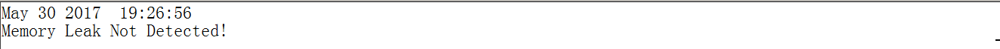

case2:  
>文件名:main.cpp

~~~cpp
#include <iostream>
#include <string>
#include "MemoryLeakCheck.h"

int main ()
{
	int* a = new int (5);
	char* b = new char;
	string c("cat");
	delete b;
	return 0;
}
~~~

>发生了内存泄漏，控制台输出：
>
>
>文件写入的内容：  
>
>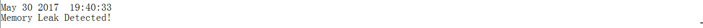

###4.什么是内存越界  
####*简介
内存越界可以分为`读越界`和`写越界`，`读越界`是指当用户向系统申请了一块内存后（可以 位于堆空间，可以位于栈空间，也可以位于静态数据区），在读取数据时，超出了申请的范围；`写越界`是指用户在写入数据时，超出了申请的范围。  

####*危害
内存越界可能会导致程序的**数据被篡改或者无法访问**，从而使程序乃至系统发生不可预见的错误，这些错误可大可小，往往不可重现，对程序和系统的稳定性、安全性等方面构成了巨大的威胁。

####*解决内存越界
和内存泄漏一样，避免内存越界的发生需要程序员良好的编程习惯，同时，这些错误也是难以发现的。因此，我们希望能够想出一种自动检测的方法，在此，通过重载`new`和`delete`，可以对堆空间中的**`写越界`**进行自动检测。（对于`读越界`重载`new`和`delete`难以实现检测）

###5.通过重载`new`实现对内存越界_`写越界`的自动检测
####*算法
1.全局的类`WriteCheck`的实例对象的析构函数在`main`函数结束时一定会执行，所以我们的`检测函数`就位于这样一个类的析构函数中(这与处理`内存泄漏`时的算法思想类似)。  

2.在`WriteCheck`类中建立一个关联容器`map`的对象`m_map`(这与我们在处理`内存泄漏`时的做法类似),`m_map`的键值为`void*`,该`void*`指向`new`分配的内存，`m_map`的映射值为一个类`Entry`,这个类存储了`new`分配内存的长度(`size_t`的值)，以及调用`new[]`的文件名和行数。即在`m_map` 中建立了从`内存地址`到`相应内存信息`的映射。  

3.重载`new`，在函数`operator new`中分配一块长于`size_t size`长度的内存，将多分配的内存初始化（例如初始化为0）,然后把`void*`,`size_t size`,`文件名`，`行数`信息存入2中所提到的`m_map`中。如果发生内存写越界，这些多分配的内存空间中的值就会和初始值不同，即发生了内存越界，最后，我们在1中提到的析构函数中进行判断即可。  

注：实现内存写越界的自动检测并不用重载`delete`，也不会影响`main.cpp`的`main函数`中的顺序容器和关联容器的使用。

####*代码
>文件名：MemoryOutOfBounds.h

~~~cpp
/*
* MemoryOutOfBounds.h
*
* WriteCheck类成员函数的声明以及new重载声明
*
* Author:雷怡然
*
* Date:2017/5/27
*/
#ifndef MEMORYOUTOFBOUNDS_H_
#define MEMORYOUTOFBOUNDS_H_

#include <map>
using namespace std;

class WriteCheck
{
public:
	class Entry										 
	//Entry类用来记录分配内存的信息
	{
	public:
		char *File;									 
		//用来记录发生内存泄漏的源文件名称
		int Line;									  
		//用来记录发生写越界对应的new所在行数
		int Length;									  
		//用来记录new参数size_t的大小
		Entry():Line(0),Length(0){}					  
		//默认构造函数
		Entry(char m_file[],int m_line,int m_length)
			:Line(m_line),File(m_file),Length(m_length){}		
		//重载构造函数
		~Entry(){}									  
		//析构函数
	};
private:											
	map<void*,Entry > m_map;						 
	//记录内存分配的map，键值为new分配的内存地址，对应的值为类Entry//
	typedef map<void*,Entry>::iterator m_iterator;	 
	//重命名map<void*,Entry>迭代器的名字，方便使用
public:
	bool on;										 
	/*用来表示WriteOut类的全局对象是否存在,true表示未结束,
	false表示析构函数执行，即主函数结束*/
	void addMap (void *p,char* m_file,int m_line,int m_length);	
	//用来添加map中的信息
	void checkMap ();								 
	/*用来检查map中的Entry元素,如果初始值被修改，
	则发生写越界，否则没有，并进行汇报*/
	WriteCheck():on(true){}						   
	//程序开始后，会将on设为true。
    ~WriteCheck();
};

			
void* operator new[] (size_t size,char *m_file,int m_line);	
 //operator new[]函数,char* m_file是文件名,int m_line是行数
void* operator new (size_t size,char *m_file,int m_line);
//operator new函数只是形式上重载以符合宏定义
#define EXTRALENGTH 100				  
//多分配内存的长度
#endif
~~~

>文件名:MemoryOutOfBounds.cpp

~~~cpp
/*
* MemoryOutOfBounds.cpp
*
* WriteCheck类成员函数的定义以及new重载定义
*
* Author:雷怡然
*
* Date:2017/5/27
*/
#include "MemoryOutOfBounds.h"
#include <iostream>
#include <fstream>

WriteCheck m_writecheck;									
//类WriteCheck的全局对象

WriteCheck::~WriteCheck()				
{
	checkMap();												
	//执行m_map的检查
	if (on==true)	
		on=false;											
	//主函数结束，置为false
}

void WriteCheck::addMap(void *p,char* m_file,int m_line,int m_length)
{
	m_map[p] = Entry(m_file,m_line,m_length);				
	//向m_map中添加信息
	unsigned char* temp =(unsigned char *)p;				
	//多分配的内存用unsigned char来初始化一个 unsigned char变量占1字节//
	int start = m_length / sizeof (unsigned char),			
	//计算多分配的内存转换成unsigned char后的下标范围//
	end = (m_length+EXTRALENGTH) / sizeof (unsigned char);
	for (int i=start;i<end;i++)		  //初始化多分配的内存，全部置为0
		temp[i] = 0;
}

void WriteCheck::checkMap()
{
	ofstream out("LOG.txt",ofstream::app);	  //输出文件流
	unsigned char *temp=NULL;								
	//用来将void *转换为unsigned char*
	bool first = false;						  //一个输出控制开关
	int start=0,end=0,i=0;
	for (m_iterator it = m_map.begin();it!=m_map.end();it++)
	{
		temp = (unsigned char *)it->first;					
		//获取m_map中Entry存储的内存地址
		start = it->second.Length / sizeof(unsigned char);  
		//计算下标范围
		end = ( it->second.Length + EXTRALENGTH )
			   /sizeof (unsigned char);
		for (i = start;i<end;i++ )			  //检查初始值是否改变
			if (temp[i]!=0)
				break;
		//输出部分
		if (i!= end)
		{
			if (first==false)
				{
					cout<<"Write memory out of bounds DETECTED!"<<endl;
					out<<__DATE__<<"\t"<<__TIME__<<endl<<
						"Write memory out of bounds DETECTED!"<<endl;
					first = true;
				}
			cout<<"file:"<<it->second.File<<"\tline:"
				<<it->second.Line<<endl;
			out<<"file:"<<it->second.File<<"\tline:"
				<<it->second.Line<<endl;
		}
	}
	if (first==false)
	{
		cout<<"Write memory out of bounds NOT DETECTED!"<<endl;
		out<<__DATE__<<"\t"<<__TIME__<<endl<<
			"Write memory out of bounds NOT DETECTED!"<<endl;
	}
	out<<endl;
}

void* operator new[] (size_t size,char *m_file,int m_line)
{
	void* p = malloc (size+EXTRALENGTH);				 
	//多分配EXTRALENGTH字节的长度的内存
	if (m_writecheck.on==true)							 
	//如果main函数没有结束
		m_writecheck.addMap(p,m_file,m_line,size);
	return p;
}

void* operator new (size_t size,char* m_file,int m_line) 
	//形式上的重载为了符合define宏定义
{
	void *p = malloc(size);
	return p;
}
~~~

>文件名:define.h

~~~cpp
/*
* define.h
*
* new的宏定义
*
* Author:雷怡然
*
* Date:2017/5/27
*/

#define new new(__FILE__, __LINE__)		
/*宏定义,把new替换成我们定义的
operator new (size_t size,char *m_file,int m_line)函数
用到了__FILE__,__LINE__宏来获取当前文件名和当前行数*/
~~~

####*功能
本程序可以实现对`写越界`的自动检测，如果发生了`写越界`，则输出**`Write memory out of bounds DETECTED!`**，并且输出发生`写越界`对应的`new`的所在文件名和行数；如果没有发生`写越界`,则输出**`Write memory out of bounds NOT DETECTED!`**。最后将是否发生内存越界写入文件LOG.txt。

####*测试
#####*case1:

>文件名：main.cpp

~~~cpp
#include <iostream>
#include "MemoryOutOfBounds.h"
#include "define.h"
using namespace std;

int main ()
{
	int *a = new int[10];
	a[12] = 5;
	return 0;
}
~~~

>发生了内存越界，控制台输出:
>
>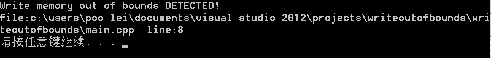
>文件输出:
>
>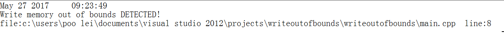

#####*case2:
>文件名：main.cpp

~~~cpp
#include <iostream>
#include "MemoryOutOfBounds.h"
#include "define.h"
using namespace std;

class dog
{
public:
	char name[20];
	int speed;
	int loyalty;
};

int main ()
{
	dog *a = new dog[10];
	a[11].speed = 100;
	return 0;
}
~~~

>发生了内存写越界，控制台输出
>
>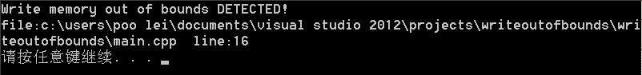  
>文件输出:
>
>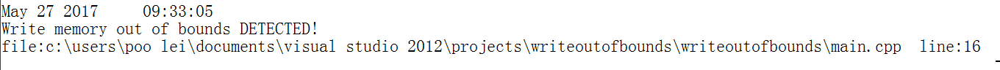

#####*case3:
> 文件名:main.cpp

~~~cpp
#include <iostream>
#include "MemoryOutOfBounds.h"
#include "define.h"
using namespace std;

int main ()
{
	char name[20];
	name[0] = 'L';
	name[1] = 'Y';
	name[2] = 'R';
	return 0;
}
~~~
>没有发生内存越界，控制台输出：
>
>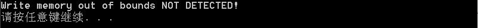  
>文件输出:
>
>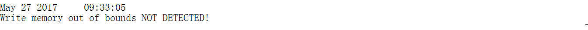

####*进一步探讨
其实，我们也可以实现对内存越界中`读越界`的自动检测。我们可以重载中括号运算符`[]`，但是，`[]`运算符只能够在**类中**重载，并不能在**全局重载**，所以，这种方法对int,char等数据类型的`读越界`也是无能为力的。 
 
对于类中`[]`的重载，其基本思路是记录分配的数组长度，然后在调用`operator [int index]`时，比较记录的长度和`index`的大小，即可判断是否发生`读越界`。

###6.结语
我们通过重载全局`new`和`delete`的方法，实现了对`内存泄漏`和`内存越界`的自动检测。同时在本次程序设计中，作者兼顾了`C++`的模块化，易复用的特点，做到了代码易移植性。  

但是，每个程序员应该谨记的是，**在编程过程时要始终保持良好的编程习惯**，这样才能在根本上避免内存泄漏,内存越界以及其他问题。

###7.参考资料

>《C++ Primer(第5版)》  
《Thinking in C++》  
<https://en.wikipedia.org/wiki/Memory_leak>
<http://blog.csdn.net/na_he/article/details/7429171>  
<http://blog.csdn.net/realxie/article/details/7437855>
<http://blog.csdn.net/wyg1065395142/article/details/50930395>
<http://blog.csdn.net/ghevinn/article/details/18359519>
<http://blog.csdn.net/chinabinlang/article/details/8331704>
<http://blog.sina.com.cn/s/blog_6b2a69300100xrpw.html>  

###8.作者信息  
>雷怡然  
>清华大学软件学院  
>邮箱:leiyr16@mails.tsinghua.edu.cn  